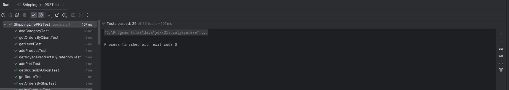
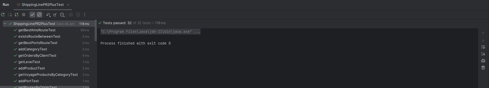
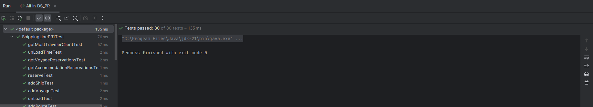

## PR2

## Author
- #name
- #email

## Introducción
En esta práctica, he tenido que implementar los nuevos modelos y los métodos de la clase ShippingLinePR2Impl.
En este informe explico lo que he hecho en cada parte del proyecto.

## Desarrollo

**Modelos**

Lo primero que he hecho en este proyecto es crear los nuevos modelos en la carpeta **src/main/java/uoc/ds/pr/model**.
Los nuevos modelos que he implementado son:
+ Port
+ Category
+ Product
+ Order

Cada modelo tiene sus atributos, constructor, getters y setters.

Además, he añadido el atributo **level** (*ShippingLinePR2.LoyaltyLevel*) en la clase Client. Por defecto el nivel del usuario es Bronze.

También he añadido la clase **LoyaltyLevel** en la carpeta **src/test/java/uoc/ds/pr/util** para pasar el test LoyaltyHelperTest.
Tiene un método estático que devuelve el nivel correspondiente según el número entero que se le pase.

Por otro lado, he tenido que hacer pequeños cambios en algunos de los modelos ya existentes.

**TADs**

En esta práctica no ha sido necesario implementar nuevos TADs, con los que hay en la librería ha sido suficiente.

**Excepciones**

He creado todas las excepciones que se necesitaban para ShippingLinePR2Test y ShippingLinePR2 en la carpeta **src/main/java/uoc/ds/pr/exceptions**. Todas las excepciones extienden de DSException.

**ShippingLineImpl**

En esta clase he tenido que hacer algunas pequeñas modificaciones:
+ Cambiar las estructuras de datos de trayectos, clientes y travesías por las nuevas que se mencionan en la PEC2.
+ En el método addRoute(), añadir las excepciones que hacen falta para pasar los tests

**ShippingLinePR2Impl**

He creado esta nueva clase para implementar los métodos necesarios para pasar los tests de ShipiningLinePR2Test. Esta clase extiende de ShipingLineImpl e implementa la interfaz ShippingLinePR2.
Para implementar estos métodos, primero escribí el código y después mientras ejecutaba los tests fui arreglando pequeños errores y descuidos que tuve.

No voy a explicar todos los métodos, ya que ya está explicado en la PEC2 y además he añadido bastantes comentarios en el código.

Explicaré brevemente los métodos opcionales, ya que son con los que más dificultades me he encontrado.

+ *existsRouteBetween()*: Este método utiliza el método recursivo visitPort() para comprobar si existe un camino entre el puerto A y el B.
El método visitPort() va visitando los puertos desde el origen hasta el destino, es decir, desde el origen se buscan las posibles aristas y se va iterando hasta intentar encontrar el puerto de destino.
+ *getBestKmsRoute()*: Este método aplica el **algoritmo de Dijkstra** para encontrar el camino con menor distancia. Gracias a la asignatura Grafos y Complejidad conocia este algoritmo.
Casi todo lo implementé yo sin buscar información pero me faltaba algún detalle para que funcionara bien, así que tuve que buscar información.
+ *getBestPortsRoute()*: Este método aplica el **algoritmo BFS** (*Breadth-first search*, en inglés) para buscar el camino más corto (menor número de puertos) entre el puerto de origen y el de destino.
Para implementar este método busque información desde el principio, ya que al principio no tenía idea de como implementarlo. El código en el que me base está en GitHub (lo adjunto en referencias), pero no es igual ya que utiliza nodos.
Este método ha sido el que más me ha costado.

## Resultados tests

He decidido no añadir más tests, considero que con los que hay se prueban todos los métodos que he implementado.

En la raíz del proyecto adjunto imágenes con el resultado de los tests.
Se han ejecutado correctamente los 29 tests de **ShippingLinePR2Test** y los 32 de **ShippingLinePR2PlusTest**.
También se ejecutan correctamente el resto de los tests del proyecto (haciendo click derecho sobre la carpeta *test/java* y seleccionando la opción *Run 'All tests'*).

Ejecución tests ShippingLinePR2Test:

Ejecución tests ShippingLinePR2PlusTest:

Ejecución de **todos** los tests del proyecto:

## Conclusión

En esta práctica he tenido que implementar los nuevos modelos, he hecho algunos pequeños cambios en algunos de los modelos ya existentes y la implementación de los métodos de ShippingLinePR2Impl.

No ha sido necesario añadir nuevos TADs, con los que había en la librería ha sido suficiente.

Tampoco he añadido nuevos tests, ya que considero que con los que hay se prueban todos los métodos que he implementado.

Lo que he hecho en esta práctica ha sido primero escribir el código, después ejecutar los tests y por último corregir errores y descuidos.
La mayoría de los métodos eran bastante sencillos de implementar, los 3 métodos opcionales (como se menciona en la PEC2) han sido los que más me han costado, pero al final los he podido implementar correctamente.

## Referencias

https://www.geeksforgeeks.org/shortest-path-in-a-directed-graph-by-dijkstras-algorithm/ \
https://www.baeldung.com/java-dijkstra \
https://en.wikipedia.org/wiki/Dijkstra%27s_algorithm#Pseudocode \
https://www.geeksforgeeks.org/shortest-path-unweighted-graph/ \
https://aquarchitect.github.io/swift-algorithm-club/Shortest%20Path%20(Unweighted)/ \
https://github.com/zhaohuabing/shortest-path-unweighted-graph-bsf-java/blob/master/src/main/java/com/zhaohuabing/Graph.java